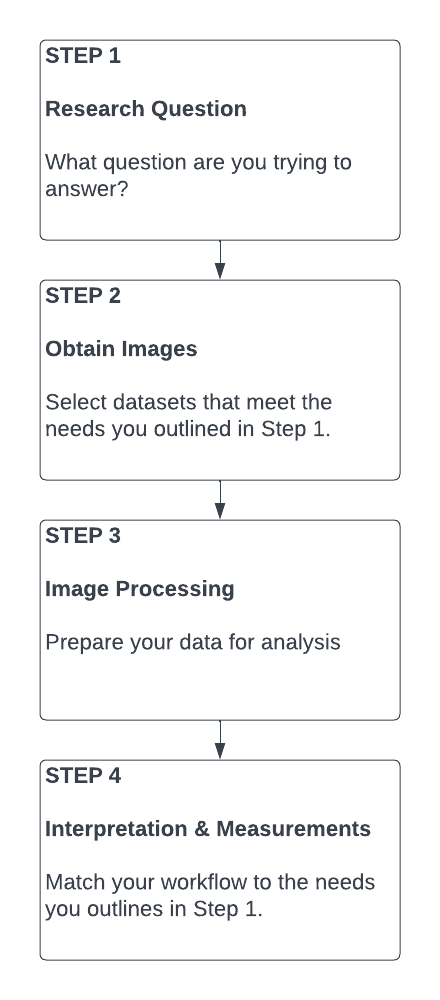

# workshop-photogrammetry
This is an introductory workshop on photogrammetry.

# Introduction

"Photogrammetry is the art, science and technology of obtaining reliable information about physical objects and the environment through processes of recording measuring and interpreting images and patterns of electromagnetic radiant energy and other phenomena." [[ASPRS](https://www.asprs.org/organization/what-is-asprs.html)]

So... photogrammetry is learning about objects or places through photographs (and/or similar data collection methods). That's it. The name sounds fancy - old school even. But on the surface, it's something you do every time you open Instagram. How we make scientific measurements is more detailed (and involves a lot of geometry), but we'll handle that aspect in a little while. And photogrammetry has only been around as long as photography, so in the grand scheme of history, it's pretty new. Modern photogrammetry is actually quite cutting edge and useful for a variety of applications. So go put away your academic robes and leather-bound books. We won't need them today.

The outline of the workshop could easily structure an entire book, so we won't go into significant depth in a 2-hour workshop. My goal is to help you understand the major parts of the modern photogrammety workflow and learn the terminology that will allow you to continue learning on your own. I am coming from a focus on terrestrial remote sensing in my own, however, there are methods for investigating aquatic systems including tools for imagery and bathymetry that I can discuss generally.

# Step 1: What Question Do You Want to Answer?

Before you do anything else, you need to define your goals. What question do you want to answer? The goals you set for your line of questioning will form the foundation of every decision you need to make going forward. The importance of this step cannot be overstated.

Thinking about the question you want to answer, what properties should your photo dataset have?

Consider theses questions:

 * What **geographic area** do you want to investigate?
 * What **geographic scale** do you need to work at? Are you interested in a global question, something hyper local like a beach, or something in between like a city or county?
 * **How large are the objects or phenomena** you want to detect? Are you identifying trees? Maybe small shrubs? Park benches?
 * What **time scale** are you working with? Do you just need one point in time? When is it? 
 * Do you want to understand this question over time? **How often** do you need images? Are you interested in daily, weekly, yearly change? For how long? When does it **start and end**?
 * What **time of day** are you interested in? Or do you need data at night?
 * What **wavelengths** will help you detect these objects or phenomena? Studies of plants often require infrared, for example.
 * What is your **budget**? Can you afford to pay for data or do you need to use open or free data sources.

 
# Step 2: Obtain Your Images
 
## Which Dataset?

The dataset you choose to work with should have similar properties to the dataset requirements you outlined in Step 1 where you defined the question you want to answer. The first choice you'll need to make is whether you need to work with an existing dataset, collect your own data, or do a combination of both options.  

Academics: now is the time to start your literature review. Understanding your target system well will help you answer these questions and also know what other people have tried before you.
 
## Existing Datasets

Existing datasets have some advantages. Existing data is the only way to get imagery from the past (without a time machine). If I want to know what a site looked like 10 years ago, I cant' go back in time to collect new data, I have to consult an existing dataset.

Existing datasets have disadvantages. You have to work with what already exists, which means you're limited to what other people decided to collect and by the technology of the time. For example, color photography wasn't widely available until Kodak introduced Kodachrome film in 1935. I still wouldn't expect to find many color air photos from this time.

There are opportunities here. When you work with older data sources, you have a chance to learn about different technologies and the history around them.

**Aerial photography collections**

Many institutions, especially academic libraries and government agencies of many levels, have collections of aerial photographs for the locations of interest to them. UC Davis has an extensive print and film collection for our local area and surrounding agricultural areas going back to the 1920s. UCSB has an online search tool for their huge air photo collection. And even the City of Davis maintains a modest collection of photos from town over time. UC holdings are searchable and accessible to affiliates and the public.  Getting access to collections can be the biggest challenge, but a polite email can be the best way to start the conversation if it's not immediately clear how to access any given collection. Be prepared that you may need to have a plan to scan or photograph the images you want before hand.

**Satellite imagery**

Satellite imagery is generally available for time periods after the mid-1970s. There were programs earlier than this going back to the late 1940s, but these were experimental and typically local in geographic scale. Earlier satellites produced images a coarser geographic and radiometric scales than modern satellite sensors.

## Collect Your Own

\#maptimeDavis has literally done whole workshops on collecting your own imagery with both drones and kites, so we won't take time to go into detail on these.

The advantages to collecting your own photos is that you're in control. You choose the day, the place, and the sensors. These systems are an option for small areas. These platforms can also just be fun to use. There's nothing like seeing the photos you just took from high above of the ecosystem you're currently standing in and seeing something you didn't expect.

The disadvantages are of collecting your own photos should not be ignored. (Here's where we have the serious talk.) The expense of a drone photo system is not small. Kite systems, while typically much less expensive than drones, require you to design your own system - there are no widely accepted commercial packages of hardware for kites. Depending on the platform you choose (drone, kite, balloon, etc.), you will have safety and legal restrictions to contend with. With all of these platforms, you run the risk of physical personal harm. You also need to develop the skills required to run the collection platforms. 

Keep in mind that you are flying an aircraft and you are required to follow the FAA rules and restrictions that pertain to the platform you are flying. This includes tethered systems like kites and balloons.

You cannot collect your own data yesterday (unless you actually collected it yesterday). There's no going back in time, so if you're collecting your own imagery, you can only collect new data now or in the future.

Options: 

* Drone
* Kite
* Balloon
* Contract with an Air Photo Company

## Combine Existing and New Datasets

You can't go back and collect done data from 1980. But you can (potentially) get air photos or satellite data from then and use it with contemporary imagery to understand change over time. It's ok to combine data from different sources. Just be aware of the limitations. You may not have the same power to detect things of small sizes in images collected by different systems.

| Platform  | Geographic Scale | Return Interval | Wavelengths | Coverage | Considerations |
| ------------- | ------------- | ------------- | ------------- | ------------- | ------------- |
| Aerial Photography - Commercial | Moderate (depends on flying height) | Typically Single Flights  | Panchromatic (BW), Color, or IR  | Sparse | Source of historical information |
| Aerial Photography - Drone or Kite  | Local (depends on flying height)  | You Decide  | Depends on the cameras or sensors you select, but typically RGB + IR  | Sparse | This is typically a DIY space to work in; Only useful for small geographic areas |
| Satellites - NASA or ESA  | local to global | ~1-30 days (depends on the platform) | Depends on the platform, but some are hyperspectral | Global | Good for recent historical questions; Pixel size may be too large for detecting small objects|
| Satellites - Commercial  | local to global | ~1-30 days (depends on the platform) | Depends on the platform, but some are hyperspectral | Global | Good for recent historical questions; Pixel size may be too large for detecting small objects; cost is a factor but look into education & research grants|

<!---| Platform  | Geographic Scale | Return Interval | Wavelengths | Coverage | Considerations | -->

# Step 3: Processing

You processing workflow should be tailored to your data needs.

Possible photo processing steps (in no particular order):

 * Cropping/Masking - reduce the size of your data by removing areas that aren't needed for the analysis
 * Stitching/Mosaicing - combine photos to make one continuous, larger dataset
 * Calculating Indexes - perform math on bands of your imagery to help detect objects of interest. For example, NDVI can help identify plants and NDWI can help identify water.
 * Build 3D Models - sets of air photos with overlap (even old ones) can be used to build models of the structures present in the photos

# Step 4: Interpretation & Measurements

There are entire courses in how to do this step, and your process will depend on your question. 

How do you know how to do this process?
 * Take an introductory course
 * Textbooks
 * Explore the academic literature for methods about air photo interpretation for your (and possibly related) systems 

What are some options?
 * Digitizing boundaries by hand on photos (heads-up digitizing)
 * Image classification - classify pixels into groups using supervised or unsupervised methods
 * Image segmentation - identify objects in photos, for example, cars or boats
 * Quantifying change over time (or distance) in some measurement
 
# Further Resources

## Organizations
[American Society for Photogrammetry and Remote Sensing (ASPRS)](https://www.asprs.org/) - academic society for imagery and GIS

[International Society for Photogrammety and Remote Sensing (ISPRS)](https://www.isprs.org/) - academic society for imagery and GIS

[#maptimeDavis](https://maptimedavis.github.io/) - check out the workshop archive for past workshops

## Tutorials & Workshops

[#maptimeDavis Workshop: Multispectral Kite Aerial Photography & Photo Processing](https://www.youtube.com/watch?v=CbotW3q_cyE&t=1s)

[#maptimeDavis Workshop: Getting Started with Drones in Scientific Research](https://www.youtube.com/watch?v=9JtZbhJEk8Y)

Coming Soon: #maptimeDavis Workshop: Downloading Satellite Data from SpatioTemporal Asset Catalogs (STAC)

## Books

The University of California system has access to thousands of books on remote sensing. Many of them include online access. Look for general books, but also look for books and journal articles that are written specifically about the kinds of environments you want to work in.

[Practical Handbook of Remote Sensing (Lavender and Lavender 2023)](https://search.library.ucdavis.edu/permalink/01UCD_INST/1hjlc2p/cdi_askewsholts_vlebooks_9781000862225)
